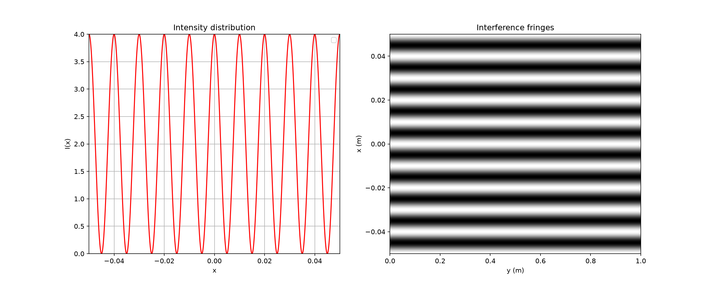

# Double-Slit Interference Simulator

## Overview

This project simulates the interference pattern produced by the classical Young's double-slit experiment using Python. 

The objective is to visualize how the intensity distribution on a screen depends on the phase difference between two coherent light sources.

The simulation is based on wave optics and demonstrates one of the fundamental experiments that reveal the wave nature of light.

## Physical Background

When monochromatic light passes through two narrow slits, the waves emitted by each slit interfere with each other. Depending on their phase difference, constructive and destructive interference occurs, creating a characteristic fringe pattern on the observation screen.

The intensity distribution can be described by:

- I(x) = 2I₀(1 + cos(2πδ/λ))  or
- I(x) = 2I₀(1 + cos(2πx/i))

where:

- I is the observed intensity (W/m^2)
- I₀ is the maximum intensity (W/m^2)
- λ is wavelength (nm)
- δ is optical path difference
- i is fringe spacing (mm)
- x is position on screen (cm)
- D is distance from slits to screen (m)
- a is slit separation (mm)
  
with 
- δ=ax/D and
- i=λD/a

## Objectives

- Simulate the intensity distribution of a double-slit experiment.
- Visualize interference fringes.
- Study the influence of physical parameters such as wavelength and slit separation.
- Develop numerical simulation skills using Python.

## Tools

- Python
- NumPy
- Matplotlib

## Results

The program generates two visualizations:

**1. Intensity Distribution**
Shows I(x) as a function of position on the screen, with peaks (bright fringes) and zeros (dark fringes).

**2. Interference Fringes**
Visual representation of the fringe pattern on the observation screen.

## Future Improvements

- Add diffraction envelope effects.
- Create an interactive graphical interface.
- Extend the simulation to multiple slits (diffraction grating).
- Compare theoretical and experimental results.

## Author

NGUYEN Le Khanh Duy

Physics Student interested in Photonics, Semiconductor Lithography and Computational Physics.
